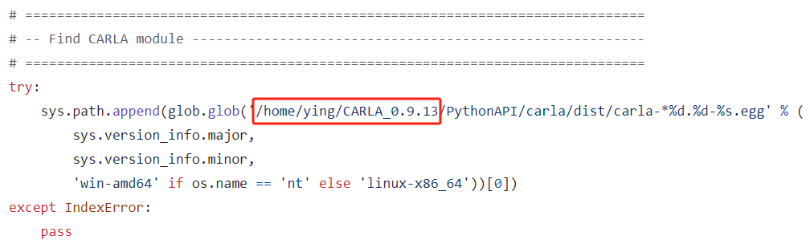

# AutoSimCarla

*A KITTI like Autonomous Driving Dataset simulating by Carla*

<p align='center'>
    
</p>

## Preparation

- Install [CARLA](https://carla.readthedocs.io/en/latest/start_quickstart/#carla-installation) and related packages in requirements.txt.
- change CARLA path according to your installation.




## Scene settings

modify `config.yaml`


## Run code

```bash
python automatic_control.py # Generate KITTI like dataset

python visulization.py # Visualization and also an example for data processing
```

<!-- ## References

[Lidar data with motion distortion](http://asrl.utias.utoronto.ca/datasets/mdlidar/index.html) -->
